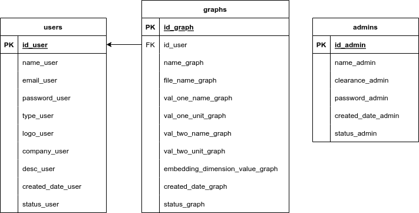

<h1>Web Of Chaos</h1>

<h3>Introduction:</h3>

The "Web Of Chaos" project aims to create an easy-to-use online system for predicting time series data using Chaos Theory. This cost-effective alternative to Matlab offers users an intuitive platform with advanced analytical tools, promotes chaos research in Malaysia, and provides features like usage reports and seamless data processing, making cutting-edge analysis accessible to all.

<h3>Objective:</h3>
<ul>
    <li>Determine the existence of chaotic behaviour concerning  time series data</li>
    <li>Predict time series data by using local linear approximation method</li>
</ul>

<h3>Features:</h3>
<ul>
    <li>User-friendly website interface for data upload and analysis</li>
    <li>Utilizes Chaos Theory for accurate time series prediction</li>
    <li>Outputs include graphs of time series data, prediction graphs, and correlation coefficient values.</li>
    <li>Results downloadable in PDF format.</li>
</ul>

<h3>Applications & user experience:</h3>
<ul>
    <li>Support diverse fields such as atmospheric science, medical research, hydrology, and finance.</li>
    <li>User can sign up, upload their data, and receive detailed reports.</li>
    <li>The website includes features for users to view and manage their usage reports.</li>
</ul>

<h3>Database Design:</h3>

<h3></h3>

<h3>Colaboration between</h3>

